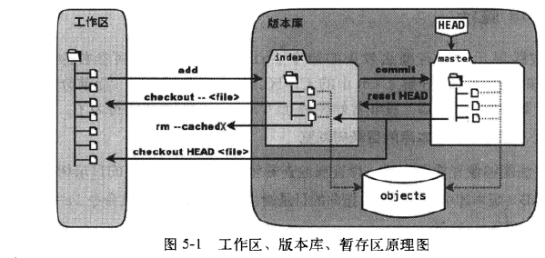

#1.Github SSH KEY生成

在git bash环境下

- 1.配置user.name,user.email
	
		git config --global user.name 'yourname'
		git config --global user.email 'you@example.com'
		//可以是用git config -l 查看已进行的设置

- 2.生成SSH
	
		ssh-keygen -t rsa -C 'you@example.com'

	按3个回车，密码为空。
    
	得到id_rsa和id_rsa.pub（windows下为c:/User/yourname/.ssh目录下；linux在~/.ssh下）,进到相应目录，输入
	
		ssh-add
- 3.在github中添加密钥
	登陆github,点击右上角的`account setting`，然后选择`SSH Keys`,`Add SSH key`
	复制`d_rsa.pub`中的内容到网页的`key`中，点击`Add key`
- 4.重启git bash 环境

#2.git常用配置和命令
	
config
	
	git config --global user.name "xxx"   
	git config --global user.email "xxx@xx.com"
	git config --global alias.co checkout//这样可以是使用 git co 代替 git checkout
	git config --global alias.ci commit
	git config --global alias.st status
	git config --global alias.br branch

command
	
	git add <file> #将file的修改提交到暂存区
	git add .      #将所有修改提交到暂存区

	git commit -m 'message'

	git branch #查看所有的branch，表星号的为当前工作分支

	git branch <branch-name> #创建名为branch-name的分支

	git checkout <branch-name> #切换到branch-name分支
	//待进一步充实
	
#3.冲突解决
git解决冲突的能力出色，一般会自动解决相应的问题，如果不同开发者对不同的文件进行修改，`merge`一般会自动完成。（注意 `git pull` 包含`git fetch` 和 `git merge`两个步骤，如果git可以自动解决冲突问题，一般执行pull就可以了）

**所以最好让不同的开发者，同时修改相同的文件**

如果出现对相同文件的相同区域进行修改，从而导致git无法自动解决冲突问题，只有通过手动编辑来解决，请搜索`git mergetool`进行相关操作的学习查阅

#4.分支的一些最佳实践
因为团队在分支上管理的实践还比较少，先借鉴已有的经验，后面再制定自己的规范。下面的一个教程供大家参考。

[git分支策略参考](http://www.ruanyifeng.com/blog/2012/07/git.html)

#5.git 一些基本概念
一些git的基本理念，有助于大家对git更好的理解（待补充）

###5.1 git 暂存区（stage）
git有三个区域：工作区,暂存区（stage），版本库参见下图

修改的文件是在工作区中修改的，修改完毕后，

- 使用 `git add` 命令会把修改写入暂存区，
- 然后，使用`git commit`命令把缓存区的内容写入版本库

